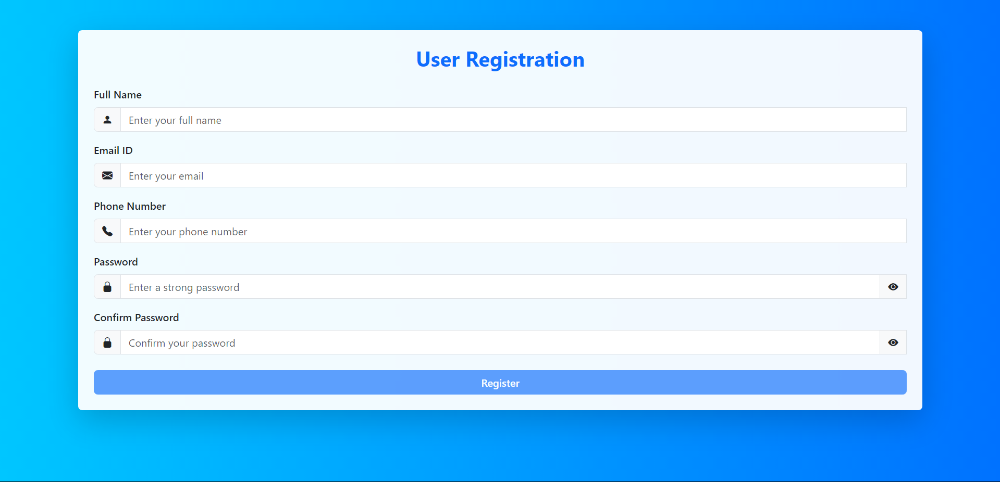

# 📝 Form Validation – Web Application  

A simple yet robust **Form Validation** web application built using **HTML**, **CSS (Bootstrap)**, and **JavaScript**.  
This project demonstrates **client-side validation techniques** and improves form handling for user-friendly web applications.  

---

## 📌 Features  
- ✅ Full Name validation (letters only, proper length)  
- 📧 Email validation (checks proper format)  
- 📱 Phone number validation (numeric, fixed length)  
- 🔑 Password & Confirm Password match validation  
- ⚡ Real-time error messages  
- 🎨 Responsive UI using **Bootstrap 5**  
- ✨ Custom styling for a clean user experience  

---

## 🛠️ Tech Stack  
- **HTML5**  
- **CSS3** (Bootstrap 5)  
- **JavaScript (ES6)**  

---

## 🚀 Live Demo  
🔗 [View Project on Netlify](https://shreyas-js-validation.netlify.app/)  

---

## 📸 Screenshot  
  

---

## 📂 Project Structure  
form-validation-project/
│
├── index.html
├── style.css
├── script.js
├── screenshot.png
└── README.md

---

## 💡 How It Works  
1. **User fills the form** → Name, Email, Phone, Password, Confirm Password.  
2. **JavaScript validation** checks input fields in real-time.  
3. **Error messages** appear instantly if validation fails.  
4. ✅ On success, the form can be submitted.  

---

## 📚 Learning Outcomes  
- Practical understanding of HTML form elements  
- Hands-on with Bootstrap grid system & utility classes  
- DOM manipulation with JavaScript  
- Event handling & validation logic for better UX  

---

## 📜 License  
This project is free to use for **learning and educational purposes**.
